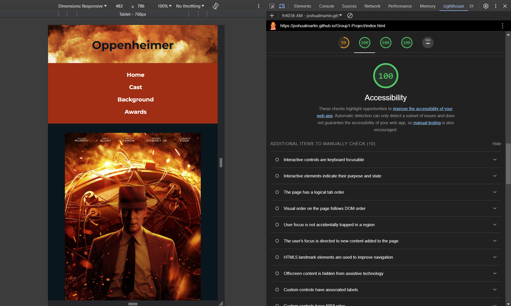
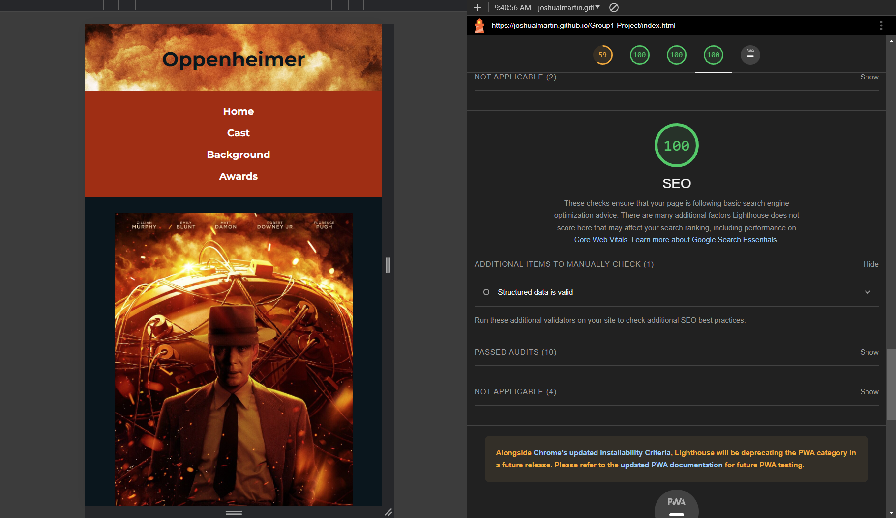

# Group 1 Project

Our website explores the recent movie *Oppenheimer* (2023). In this README file, we will detail how we met the requirements of the assignment, any challenges that we faced, and provide our style guide and wireframes.

## Deployed Website Link
Please see this link for our deployed website: [Oppenheimer](https://).

### Page Creators:
1. Home: Alejandra
2. Cast: Julia
3. Background: Josh
4. Awards: Sheryl

## How We Met the Assignment Requirements

1. Be responsive on both tablet and cell-phone sized screens.
    - We added media queries to the end of the CSS file to ensure all content would be responsive on desktops, tablets, landscape phone orientations, and portait phone orientations.
    
2.	Use CSS flexbox at least once.
    - We used flexbox in numerous places including the title, navbar, and footer. 
3.	Use semantic HTML tags where appropriate.
    - Semantic HTML tags were used at every appropriate instance.
4.	Utilize BEM naming conventions for its CSS rules.
    - All CSS rules were named using the BEM conventions.
5.	Include at least one usage of CSS transitions.
    - The navbar links include a hover transition.
6.	Include at least one usage of CSS animations.
    - The footer includes a continuous animation that mimics an explosion to reflect the content of the movie.
7.	Include a README in the GitHub repository for the project that details any challenges encountered during development as well as a link to the deployed website.
    - We have included this README file.

## Challenges We Faced
### Alejandra
- I had some issues figuring out how to create the same page with the formatting of the rest of the website, luckly Josh helped us building up the basic data for the pages.
- Refresh my knowledge on pushing and committing on a group GitHub project.
### Julia
- During my recent Github repository update, I encountered difficulties with creating branches, forking, and initiating pull requests. This unfamiliarity led to moments of frustration, resulting in a few meltdowns. Fortunately, my classmates graciously stepped in to offer guidance and support, helping me navigate through the process and successfully resolve the issues. Their assistance proved invaluable in overcoming the challenges I faced during this task
### Josh
- I had some issues figuring out how to write up the code for the CSS animation. It took some searching and learning!
- I had to refresh myself on how to make the images float and wrap text.
- I had difficulty figuring out how to manage the GitHub pull requests and get everything approved for merging (even though my teammates did everything according to the book).
### Sheryl
- I had trouble with alignment and placement. I tried to use BEM to organize CSS but I was not comfortable doing it.

## Style Guide

## Wireframes!

[Artboard 1](https://github.com/joshualmartin/Group1-Project/assets/45828392/bbbf2af9-2a59-4072-b98f-3ab7651396bd)

## SEO and Accessibility Screenshots

